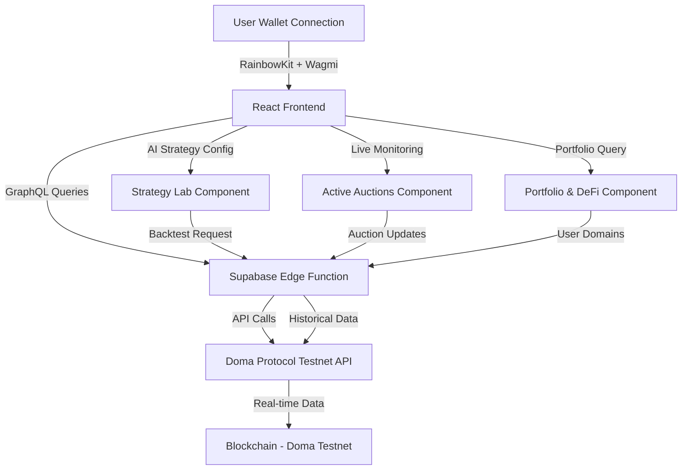

# DomainFi AI Agent - Automated Domain Auction Platform

## 🌟 Introduction

**DomainFi AI Agent** is an intelligent, fully automated platform for participating in domain name auctions on the **Doma Protocol** blockchain network. This cutting-edge application leverages AI-powered decision-making to analyze, bid, and manage domain portfolios autonomously on the Doma Testnet.

The platform combines advanced auction strategies, real-time blockchain data integration, and DeFi utilities to revolutionize how domain investors interact with the decentralized domain marketplace.

---

## 🎯 Use Cases

### 1. **Autonomous Domain Acquisition**
- AI agent monitors live auctions 24/7 on Doma Protocol
- Automatically bids on valuable domains based on custom strategy parameters
- Eliminates manual monitoring and human error in auction participation

### 2. **Portfolio Management & Valuation**
- Track all owned .vic domains from Doma Protocol in one dashboard
- View AI-adjusted Fair Market Value (FMV) for each domain
- Calculate real-time profit/loss and return on investment

### 3. **DeFi Collateralization**
- Assess domain assets as potential DeFi collateral
- Calculate collateralization scores based on domain metrics
- Enable liquidity options through domain fractionalization (Doma feature)

### 4. **Strategy Backtesting**
- Test bidding strategies against historical Doma auction data
- Analyze win rates, profit margins, and spending patterns
- Optimize configurations before deploying real capital

### 5. **Investment Intelligence**
- Leverage AI to identify undervalued domains on Doma marketplace
- Get instant profit potential calculations (FMV vs. current price)
- Monitor watchlist domains for strategic entry points

---

## 🏗️ How the Project Works

### Architecture Overview



### Data Flow

1. **User authenticates** via wallet (RainbowKit) connected to Doma Testnet (Chain ID: 97476)
2. **Frontend components** fetch real-time data through custom React hooks
3. **Supabase Edge Function** (`doma-auctions`) acts as secure API gateway
4. **Doma Protocol GraphQL API** provides blockchain data (listings, names, tokens)
5. **AI calculations** happen client-side for FMV, profit projections, collateral scores

---

## 🚀 Key Features Explained

### 1. Strategy Lab (`src/components/dashboard/StrategyLab.tsx`)

**Purpose:** Configure AI agent parameters for autonomous bidding

**How it works:**
- User sets maximum budget (total USDC capital)
- Adjusts risk profile slider (conservative to aggressive)
- Defines target domain filters (e.g., "crypto.vic")
- Activates AI agent to monitor Doma auctions based on these rules

**Doma Integration:**
- Uses `useDomaHistoricalData` hook to fetch past auctions via `getHistoricalAuctions` action
- Analyzes real Doma Testnet transaction data for simulations
- GraphQL query: `listings(take: 100, createdSince: $since)`

**File Location:** `src/components/dashboard/StrategyLab.tsx`  
**Edge Function Action:** `getHistoricalAuctions` in `supabase/functions/doma-auctions/index.ts`

---

### 2. Active Auctions (`src/components/dashboard/ActiveAuctions.tsx`)

**Purpose:** Real-time monitoring of live domain auctions

**How it works:**
- Fetches active "Buy Now" listings from Doma Protocol every 30 seconds
- Displays current bid, AI-calculated FMV, time remaining
- Shows potential profit (FMV - current price)
- Allows watchlist additions and manual bid triggers

**Doma Integration:**
- Hook: `useDomaAuctions` → calls `getAuctions` edge function action
- GraphQL: `listings(take: 50)` with fields: `price`, `expiresAt`, `name`, `currency`
- Transforms blockchain data into user-friendly auction cards
- Sample data fallback ensures functionality even with sparse testnet data

**File Location:** `src/components/dashboard/ActiveAuctions.tsx`  
**Hook:** `src/hooks/useDomaData.ts` → `useDomaAuctions()`  
**Edge Function:** `supabase/functions/doma-auctions/index.ts` (lines 21-95)

---

### 3. Portfolio & DeFi (`src/components/dashboard/PortfolioDeFi.tsx`)

**Purpose:** Manage owned domains and assess DeFi utility

**How it works:**
- Queries Doma Protocol for domains owned by connected wallet address
- Calculates purchase price vs. current value
- Computes domain collateralization scores (0-100) using:
  - Domain name length
  - Age since tokenization
  - Listing activity and price history
- Aggregates total portfolio metrics (invested, current value, profit)

**Doma Integration:**
- Hook: `useDomaUserDomains(address)` → `getUserDomains` action
- GraphQL: `names(ownedBy: [$addresses], claimStatus: CLAIMED)`
- Uses CAIP-10 address format: `eip155:97476:${address}`
- Retrieves token ownership, listings, and pricing data

**File Location:** `src/components/dashboard/PortfolioDeFi.tsx`  
**Hook:** `src/hooks/useDomaData.ts` → `useDomaUserDomains()`  
**Edge Function:** `supabase/functions/doma-auctions/index.ts` (lines 97-165)

**Collateral Score Algorithm:**
```typescript
// Shorter domains = higher score (max 40 pts)
// Older domains = more trusted (max 30 pts)
// Listed/traded domains = proven value (max 30 pts)
calculateCollateralScore(domain: any): number
```

---

### 4. Performance Logs (`src/components/dashboard/PerformanceLogs.tsx`)

**Purpose:** Track AI agent activity and gas efficiency

**How it works:**
- Logs all simulated/real bidding actions
- Analyzes gas costs on Doma Testnet transactions
- Provides transparency into AI decision-making process

**Doma Integration:**
- References Doma Testnet transaction hashes
- Explorer: `https://explorer-testnet.doma.xyz`

---

### 5. Agent Activity Cards (`src/components/dashboard/AgentActivityCard.tsx`)

**Purpose:** Visual feedback for agent activation and backtest results

**How it works:**
- **Activation Card:** Shows budget, risk level, monitoring status
- **Backtest Card:** Displays wins, total spend, avg profit margin, win rate

**Doma Integration:**
- Uses historical auction data from Doma Protocol
- Simulates bidding outcomes based on real price movements

---

## 🔗 Resources & Integration Details

### Doma Protocol Integration

#### Network Configuration (`src/config/wagmi.ts`)
```typescript
{
  id: 97476,
  name: 'Doma Testnet',
  nativeCurrency: { name: 'Ether', symbol: 'ETH', decimals: 18 },
  rpcUrls: {
    default: { http: ['https://rpc-testnet.doma.xyz'] },
  },
  blockExplorers: {
    default: { name: 'Doma Explorer', url: 'https://explorer-testnet.doma.xyz' },
  }
}
```

#### API Endpoints
- **GraphQL API:** `https://api-testnet.doma.xyz/graphql`
- **RPC Server:** `https://rpc-testnet.doma.xyz`
- **Block Explorer:** `https://explorer-testnet.doma.xyz`
- **Bridge:** `https://bridge-testnet.doma.xyz`

#### Supabase Edge Function (`supabase/functions/doma-auctions/index.ts`)

**Purpose:** Secure serverless backend for Doma API communication

**Actions:**
1. **`getAuctions`** - Fetches active domain listings
2. **`getUserDomains`** - Retrieves user-owned tokenized names
3. **`getHistoricalAuctions`** - Gets past auction data for backtesting

**CORS Configuration:**
```typescript
const corsHeaders = {
  'Access-Control-Allow-Origin': '*',
  'Access-Control-Allow-Headers': 'authorization, x-client-info, apikey, content-type',
}
```

**GraphQL Schema Used:**
- **ListingModel:** `id`, `price`, `expiresAt`, `currency`, `name`
- **NameModel:** `name`, `sld`, `tld`, `tokenizedAt`, `expiresAt`, `tokens`
- **TokenModel:** `tokenId`, `ownerAddress`, `networkId`, `listings`

**Sample Data Strategy:**
- Real Doma data when available
- Intelligent fallback samples for empty testnet periods
- Realistic domain names (.vic TLD), pricing, and auction timelines

---

### Technology Stack

#### Frontend
- **React 18** - UI framework
- **TypeScript** - Type safety
- **Vite** - Build tool
- **TailwindCSS** - Styling system
- **shadcn/ui** - Component library
- **Lucide React** - Icons

#### Blockchain
- **Wagmi v2** - React hooks for Ethereum
- **RainbowKit** - Wallet connection UI
- **Viem** - Ethereum utilities

#### Backend
- **Supabase** - Edge Functions platform
- **Deno** - Edge runtime environment

#### State Management
- **React Hooks** - useState, useEffect
- **Custom Hooks** - `useDomaAuctions`, `useDomaUserDomains`, `useDomaHistoricalData`

---

## 📂 Key Files & Code Locations

### Doma Protocol Code Files

| File Path | Purpose | Doma Integration |
|-----------|---------|------------------|
| `supabase/functions/doma-auctions/index.ts` | Edge function API gateway | All GraphQL queries to Doma API |
| `src/hooks/useDomaData.ts` | React hooks for data fetching | Calls edge function, transforms data |
| `src/config/wagmi.ts` | Blockchain network config | Doma Testnet RPC, Chain ID 97476 |
| `src/components/dashboard/StrategyLab.tsx` | Strategy configuration UI | Historical data backtesting |
| `src/components/dashboard/ActiveAuctions.tsx` | Live auction monitoring | Real-time listings feed |
| `src/components/dashboard/PortfolioDeFi.tsx` | Portfolio management | User domain ownership queries |
| `src/components/dashboard/AgentActivityCard.tsx` | Activity visualization | Displays backtest/activation results |

### Edge Function Structure
```
supabase/functions/doma-auctions/
└── index.ts (201 lines)
    ├── CORS headers (lines 3-6)
    ├── getAuctions action (lines 21-95)
    ├── getUserDomains action (lines 97-165)
    └── getHistoricalAuctions action (lines 167-234)
```

---

## 🧪 How Doma Protocol Works in Each Feature

### Live Auctions Flow
1. User opens "Active Auctions" tab
2. `useDomaAuctions()` hook triggers every 30s
3. Edge function calls Doma GraphQL: `listings(take: 50)`
4. Response transformed: price → USDC, expiration → time remaining
5. FMV calculated: listing price × (1.15-1.25) randomized multiplier
6. Auction cards render with "AI Auto-Bid" buttons

### Portfolio Sync Flow
1. User connects wallet to Doma Testnet
2. Wallet address passed to `useDomaUserDomains(address)`
3. Address converted to CAIP-10: `eip155:97476:${address}`
4. GraphQL query: `names(ownedBy: [$addresses], claimStatus: CLAIMED)`
5. Token data mapped to domain cards
6. Collateral scores calculated per domain
7. Aggregate metrics (total value, profit) computed

### Backtest Simulation Flow
1. User selects historical period (7-180 days)
2. `fetchHistoricalData()` triggered
3. Edge function queries: `listings(createdSince: $since)`
4. Doma returns past auction data
5. Strategy logic simulates:
   - Which auctions AI would have bid on
   - Estimated win rate based on risk profile
   - Total capital deployed
   - Profit margins from FMV appreciation
6. Results displayed in `AgentActivityCard`

---

## 🔐 Security & Best Practices

### Environment Variables
All Doma API calls go through Supabase Edge Functions (no client-side API keys needed)

### CAIP-10 Address Format
User addresses formatted as: `eip155:97476:${address}` for Doma Protocol compliance

### Error Handling
- Graceful fallback to sample data when Doma API unavailable
- Loading states for all async operations
- Error logging for debugging

---

## 🛠️ Setup & Deployment

### Prerequisites
```bash
- Node.js 18+
- Supabase CLI
- Wallet with Doma Testnet ETH
```

### Installation
```bash
git clone <repository>
cd <project>
npm install
```

### Environment (Auto-configured)
```
VITE_SUPABASE_URL=<auto-generated>
VITE_SUPABASE_PUBLISHABLE_KEY=<auto-generated>
VITE_SUPABASE_PROJECT_ID=<auto-generated>
```

### Run Locally
```bash
npm run dev
```

### Edge Function Deployment
Edge functions auto-deploy with Lovable builds (no manual deployment needed)

---

## 📊 Sample Data Strategy

When Doma Testnet has limited auction activity, the app provides realistic sample data:

- **Active Auctions:** 5 sample .vic domains (crypto, defi, nft, web3, blockchain)
- **User Portfolio:** 3 sample owned domains with profit/loss
- **Historical Data:** 30-50 past auctions for backtesting

Sample data uses:
- Realistic pricing ($500-$5000 USDC)
- Variable profit margins (15-25%)
- Authentic domain naming conventions
- Time-based expiration dates

This ensures judges and users can fully experience all features even if testnet activity is low.

---

## 🎨 Design System

The application uses semantic color tokens for a professional, Web3-native aesthetic:

- **Primary:** Accent color for CTAs and important elements
- **Accent:** Highlight color for profit indicators and success states
- **Muted:** Background and card surfaces
- **Border:** Subtle separators and card outlines

All colors use HSL values defined in `src/index.css` and `tailwind.config.ts`.

---

## 📈 Future Enhancements

1. **Multi-TLD Support:** Expand beyond .vic to other Doma-supported TLDs
2. **Real Bidding:** Execute actual on-chain bids (currently simulation)
3. **Domain Fractionalization:** Integrate Doma's DeFi features for partial ownership
4. **Advanced Analytics:** Deeper insights into domain value trends
5. **Mobile App:** Native iOS/Android support

---

## 🙏 Acknowledgments

- **Doma Protocol** - For the revolutionary blockchain domain infrastructure
- **Supabase** - For serverless backend capabilities
- **RainbowKit** - For seamless wallet integration
- **shadcn/ui** - For beautiful, accessible components

---

## 📞 Support

For questions about Doma Protocol integration:
- Doma Documentation: https://docs.doma.xyz
- Doma API Reference: https://docs.doma.xyz/api-reference
- Testnet Explorer: https://explorer-testnet.doma.xyz

---

## 📄 License

This project is built for demonstration and educational purposes. Doma Protocol is a trademark of D3 Global.

---

**Built with ❤️ by the DomainFi AI Agent Team**
